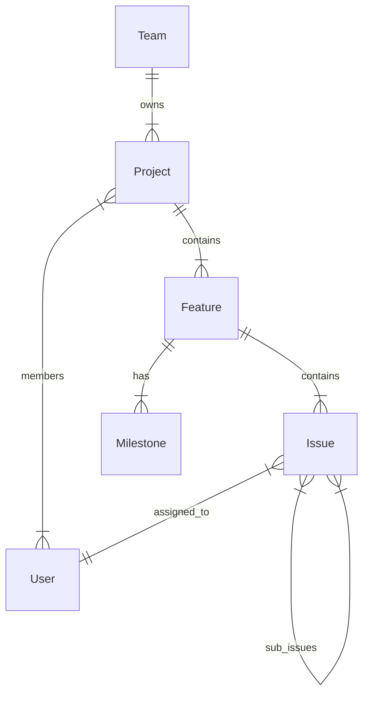

# Backend Schema Documentation

This document references the core data models defined in `Backend/app/models`.

## Core Entities

### 1. Project (`Project`)

Represents a workspace for a specific initiative.

- **Fields:** `id`, `name`, `description`, `status` (Enum), `priority` (Enum), `health` (Enum), `team_id`, `lead_id`.
- **Enums:**
  - `ProjectStatus`: backlog, planned, in_progress, paused, completed, cancelled.
  - `ProjectHealth`: on_track, at_risk, off_track.
- **Relationships:**
  - Belongs to a **Team**.
  - Has one **Lead** (User).
  - Has many **Members** (Users).
  - Has many **Features**.
  - Has many **Updates**.

### 2. Feature (`Feature`)

A distinct unit of value or capability within a project.

- **Fields:** `id`, `project_id`, `owner_id`, `name`, `status`, `type`.
- **Enums:**
  - `FeatureType`: new_capability, enhancement, experiment, infrastructure.
  - `FeatureStatus`: discovery, validated, in_build, in_review, shipped.
- **Relationships:**
  - Belongs to a **Project**.
  - Owned by a **User**.
  - Has many **Milestones**.
  - Has many **Issues**.

### 3. Issue (`Issue`)

Individual work item (Task, Bug, etc.). The atomic unit of work.

- **Fields:** `id`, `identifier` (e.g., ENG-123), `title`, `status`, `priority`, `type`.
- **Enums:**
  - `IssueType`: bug, task, refactor, chore.
  - `IssueStatus`: backlog, todo, in_progress, done, cancelled.
- **Relationships:**
  - Belongs to a **Feature**.
  - Belongs to a **Team**.
  - Assigned to a **User**.
  - Can have a **Milestone** and **Cycle**.
  - Can have a **Parent Issue** (Sub-issues).

### 4. Milestone (`Milestone`)

Time-bound checkpoints within a feature.

- **Fields:** `id`, `feature_id`, `name`, `target_date`, `completed`.
- **Relationships:**
  - Belongs to a **Feature**.

### 5. User (`User`) - _Inferred_

System user.

- **Fields:** `id`, `email`, `hashed_password`, `full_name`.
- **Relationships:**
  - Has many **Assignments** (Issues).
  - Has many **Projects** (as member/lead).

### 6. Team (`Team`) - _Inferred FROM relations_

Organizational unit.

- **Fields:** `id`, `name`.
- **Relationships:**
  - Has many **Projects**.
  - Has many **Issues**.

### 7. Document (`Document`) - _Inferred_

Project documentation artifacts.

- **Fields:** `id`, `project_id`, `title`, `content` (Markdown), `type` (Enum).
- **Enums:**
  - `DocumentType`: PRD, APP_FLOW, TECH_STACK, FRONTEND_GUIDELINES, BACKEND_SCHEMA, IMPLEMENTATION_PLAN, RFC, DECISION_LOG, OTHER.
- **Relationships:**
  - Belongs to a **Project**.
  - Versioned? (Likely needs VersionHistory table).

## Database Design Principles

- **IDs:** UUIDs used for all primary keys.
- **Foreign Keys:** Enforced with `ondelete` rules (CASCADE for structural dependencies).
- **Timestamps:** `created_at` and `updated_at` on all main entities.
- **Soft Deletes:** Not explicitly observed in inspected files (Standard Delete used).

## Entity Relationship Diagram (Textual)

